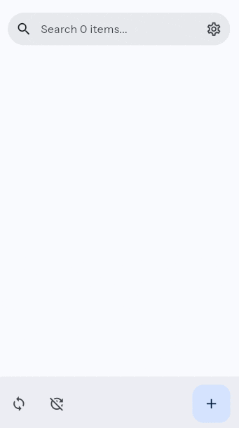

# Flync - Flutter File Synchronization

### Why this exists:

File synchronization shouldn’t require compromising on simplicity, privacy, or transparency. Current mobile options fail in this regard by being:

- Over-engineered (slow, cluttered UIs)
- Monetized aggressively (ads, paywalls)
- Closed-source (can't verify security)

### Current MVP:

- Bi-directional FTP sync with:
  - Deletion tracking
  - Timestamp-based conflict resolution
- Clean Material Design
- [Minimalist state management](https://suragch.medium.com/flutter-state-management-for-minimalists-4c71a2f2f0c1)

### What's next:

#### Polish phase:

- Finish synchronization form features
- Sync group details screen
- Separate theme from main

#### Future:

- Cloud storage integrations (OneDrive, Google Drive)
- Credentials encryption
- Synchronization error recovery
